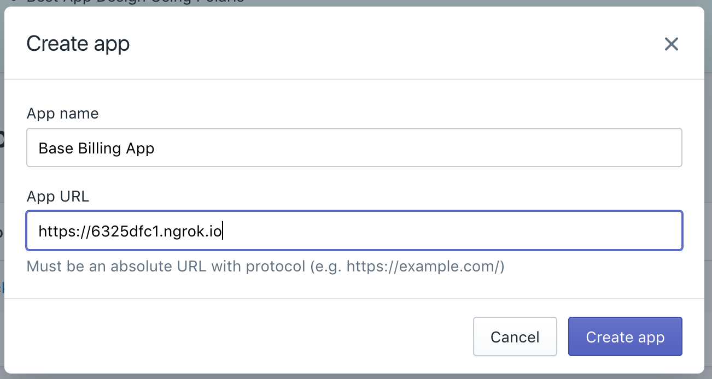
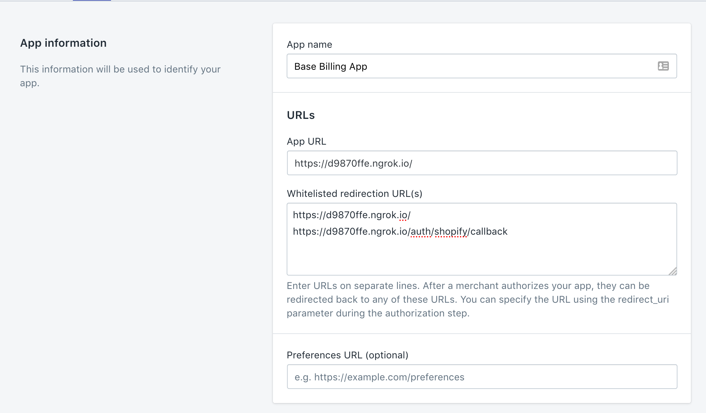
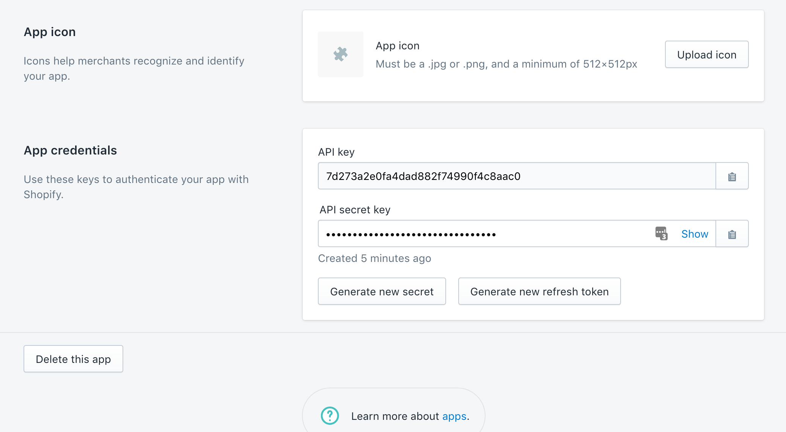
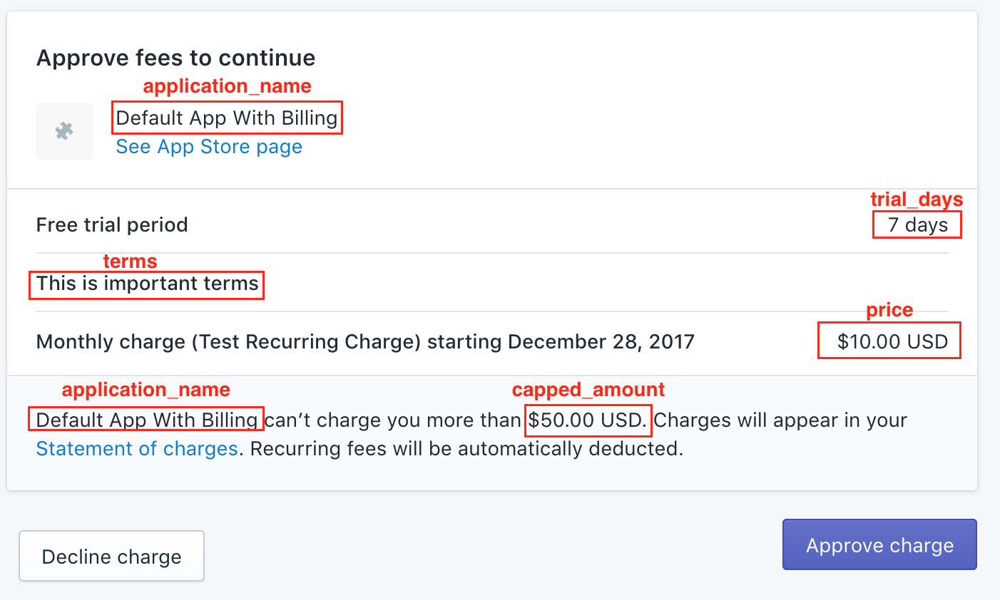

# Shopify Base Billing

This is a starter app with recurring base billing setup.  This app will get you quickly started with a working shopify application.

# Setup
## 1. Create an account
 Create an account at https://partners.shopify.com/.

## 2. Create an app

In the shopify partners dashboard click **Apps -> Create App**

#### Enter in your app information
- **App Name**: [Your App Name]
- **App Url**: https://[ngrok path].ngrok.io

#### Add Redirect URL
In shopify make sure to add the NGROK redirect URL.
`https://[your ngrok string].ngrok.io/auth/shopify/callback`

#### GET API Keys
On the same page that you set the redirect URLs, you can find the app credentials.  You will get the `API Key` and the `API Secret Key`. We will use these  when we set the environenment variables in the next step.

### NGROK

#### Install NGROK
Install NGROK at https://ngrok.com/download.

#### Run NGROK

<pre>
[/path/to_ngrok]</path>/ngrok http 3000
</pre>

# Installation

## 1. Configure Environment Variables
In `/config/initializers/shopify_app.rb` 
Set the environment variables that you got in the previous set for `SHOPIFY_APP_API_KEY` and `SHOPIFY_APP_API_SECRET`. 

You should be able to get them from 
Apps --> [Your App Name] --> App Info

<pre>
ShopifyApp.configure do |config|
  config.application_name = 'Default App With Billing'
  config.api_key = ENV["SHOPIFY_APP_API_KEY"]
  config.secret = ENV["SHOPIFY_APP_API_SECRET"]
  config.scope = "read_orders, read_products"
  config.embedded_app = true
end

</pre>

## 2. Set Charge Options
Set the charge options in `config/secrets.yml`
It should look something like this:
<pre>
shared:
  recurring_charge_name: Test Recurring Charge
  recurring_charge_price: 10
  recurring_charge_capped_amount: 50
  recurring_charge_terms: This is important terms
  recurring_charge_trial_days: 7
  is_test_charge: true
</pre>

This will set the options in shopify as seen below.

## 2. Run Migrations
<pre>
rails db:create db:migrate
</pre>

# Usage

This is what a recurring application charge looks like:
<pre>
{
   name: "Test charge",
   price: "10.00",
   trial_days: 7,
   test: true,
   return_url: "https://d9870ffe.ngrok.io/recurring_application_charge/callback",
   id: 22773776,
   api_client_id: 1918472,
   status: pending",
   billing_on: nil,
   created_at: 2017-12-17T07:46:32-05:00,   
   updated_at: 2017-12-17T07:46:32-05:00,
   activated_on: nil,
   trial_ends_on: nil,
   cancelled_on: nil,
   decorated_return_url: "https://d9870ffe.ngrok.io/recurring_application_charge/callback?charge_id=22773776",
   confirmation_url: "https://kuczmama.myshopify.com/admin/charges/22773776/confirm_recurring_application_charge?signature=BAhpBBCAWwE%3D--01914e5056e86c6e99b47c227905be8bffe242d1"
}
</pre>

# Important Links
## Shopify App
This gem includes a Rails Engine and generators for writing Rails applications using the Shopify API. The Engine provides a SessionsController and all the required code for authenticating with a shop via Oauth (other authentication methods are not supported).
- Github: https://github.com/Shopify/shopify_app
- Documentation: http://www.rubydoc.info/gems/shopify_app/8.2.5

## Shopify API
The Shopify API gem allows Ruby developers to programmatically access the admin section of Shopify stores.

The API is implemented as JSON over HTTP using all four verbs (GET/POST/PUT/DELETE). Each resource, like Order, Product, or Collection, has its own URL and is manipulated in isolation. In other words, we’ve tried to make the API follow the REST principles as much as possible.

- Github: https://github.com/Shopify/shopify_api

## omniauth-shopify-oauth2
Shopify OAuth2 Strategy for OmniAuth 1.0.

- Github: https://github.com/Shopify/omniauth-shopify-oauth2

## Billing Demo App
A large portion of this was based off of the **Billing Demo App** Found here.  https://github.com/Shopify/billing-demo-app